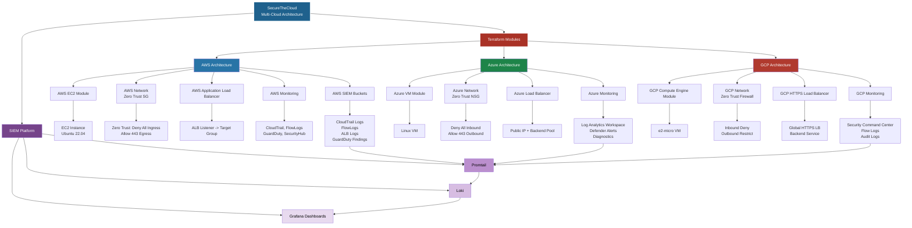

```mermaid
flowchart TD
    %% =======================
    %% MAIN SYSTEM OVERVIEW
    %% =======================
    A[SecureTheCloud<br/>Multi-Cloud Architecture] --> B[Terraform Modules]
    B --> C[AWS Architecture]
    B --> D[Azure Architecture]
    B --> E[GCP Architecture]
    A --> F[SIEM Platform]

    %% =======================
    %% AWS
    %% =======================
    C --> C1[AWS EC2 Module]
    C --> C2[AWS Network<br/>Zero Trust SG]
    C --> C3[AWS Application Load Balancer]
    C --> C4[AWS Monitoring]
    C --> C5[AWS SIEM Buckets]

    C1 --> C1a[EC2 Instance<br/>Ubuntu 22.04]
    C2 --> C2a[Zero Trust: Deny All Ingress<br/>Allow 443 Egress]
    C3 --> C3a[ALB Listener -> Target Group]
    C4 --> C4a[CloudTrail, FlowLogs<br/>GuardDuty, SecurityHub]
    C5 --> C5a[CloudTrail Logs<br/>FlowLogs<br/>ALB Logs<br/>GuardDuty Findings]

    %% =======================
    %% AZURE
    %% =======================
    D --> D1[Azure VM Module]
    D --> D2[Azure Network<br/>Zero Trust NSG]
    D --> D3[Azure Load Balancer]
    D --> D4[Azure Monitoring]

    D1 --> D1a[Linux VM]
    D2 --> D2a[Deny All Inbound<br/>Allow 443 Outbound]
    D3 --> D3a[Public IP + Backend Pool]
    D4 --> D4a[Log Analytics Workspace<br/>Defender Alerts<br/>Diagnostics]

    %% =======================
    %% GCP
    %% =======================
    E --> E1[GCP Compute Engine Module]
    E --> E2[GCP Network<br/>Zero Trust Firewall]
    E --> E3[GCP HTTPS Load Balancer]
    E --> E4[GCP Monitoring]

    E1 --> E1a[e2-micro VM]
    E2 --> E2a[Inbound Deny<br/>Outbound Restrict]
    E3 --> E3a[Global HTTPS LB<br/>Backend Service]
    E4 --> E4a[Security Command Center<br/>Flow Logs<br/>Audit Logs]

    %% =======================
    %% SIEM PIPELINE
    %% =======================
    F --> F1[Promtail]
    F --> F2[Loki]
    F --> F3[Grafana Dashboards]

    C5a --> F1
    D4a --> F1
    E4a --> F1
    F1 --> F2 --> F3

    %% =========================
    %% STYLING
    %% =========================
    style A fill:#1F618D,stroke:#fff,stroke-width:2px,color:white
    style B fill:#A93226,stroke:#fff,color:white
    style C fill:#2874A6,color:white
    style D fill:#1E8449,color:white
    style E fill:#B03A2E,color:white
    style F fill:#76448A,color:white
    style F1 fill:#BB8FCE,color:black
    style F2 fill:#D7BDE2,color:black
    style F3 fill:#E8DAEF,color:black
```
