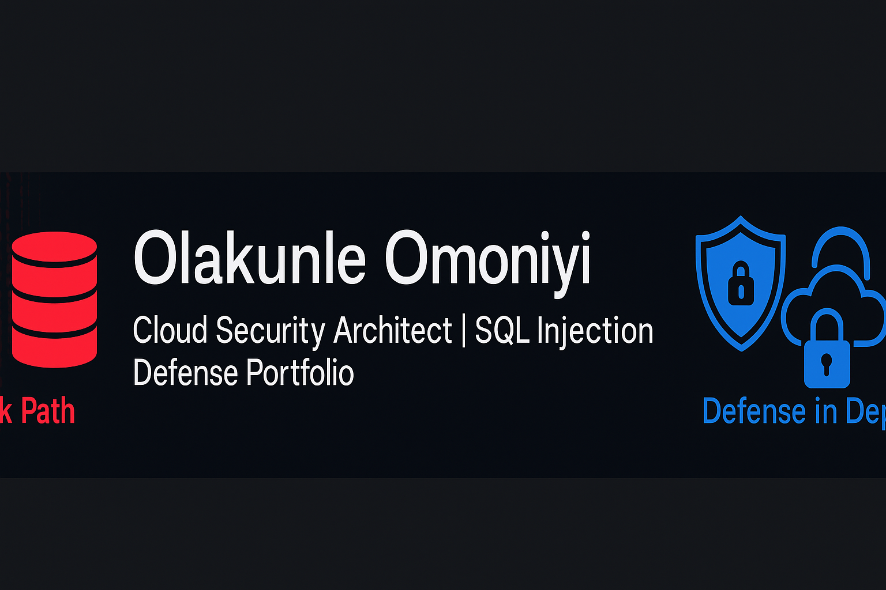
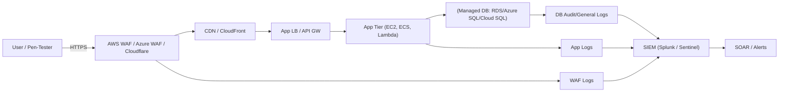

<p align="center">
  
</p>

# Cloud Security Architect Portfolio: **SQL Injection — Attack · Detect · Defend (Cloud-Native)**


-8A2BE2)


> **Elevator pitch (HR‑friendly):**  
> This portfolio shows how I approach one of the most business‑critical web risks: **SQL Injection**. I demonstrate **secure design**, **defense‑in‑depth**, and **real‑world detection** in cloud environments. It’s hands‑on, measurable, and mapped to compliance expectations (e.g., PCI‑DSS 6.5.1).

---

## 🔍 What this shows about me
- I design **cloud‑ready architectures** that prevent SQLi by default (parameterized queries, least privilege, secrets management, WAF).
- I build **detections** (CloudWatch Logs Insights, Splunk SPL, Microsoft Sentinel KQL) for attack patterns like `UNION SELECT`, `SLEEP()`, `OR 1=1`.
- I consider **blast radius** and **multi‑tenant data isolation** risks (row‑level security, tenant context enforcement).
- I write **clear runbooks** for engineers and **concise value statements** for leadership.

---

## 🏗️ Reference Architecture (Mermaid)
> *GitHub renders Mermaid diagrams automatically.*



**Design notes**
- **Code/Data separation** with prepared statements; **no raw string concatenation**.
- **Least privilege** DB user per service; **read‑only** for GET paths.
- **Secrets Manager / Key Vault** for credentials; short‑lived auth where possible.
- **WAF managed SQLi rules** in front of the app; **logging everywhere**.
- **Row‑Level Security / tenant scoping** for SaaS workloads.

---

## ✅ Business Value (outcomes you can expect)
- ↓ **SQLi risk** via enforced coding patterns and WAF: *target = zero critical SQLi findings in DAST/SAST.*
- ↓ **Mean Time to Detect (MTTD)** with log analytics & alerts for SQLi patterns.
- ↑ **Audit readiness** (evidence of controls for PCI‑DSS 6.5.1 / SOC2 CC 7.x).

> Example OKRs:  
> • Reduce SQLi findings to **0** in pre‑prod scans this quarter.  
> • Trigger **alerts within 60s** for high‑confidence SQLi patterns.  
> • Achieve **100%** parameterization coverage in top 10 data‑access paths.

---

## 🧪 (Optional) Safe Demo Plan (lab‑only)
> This is for **isolated labs only** (e.g., DVWA or a minimal test app). **Never** expose lab apps to the internet.

1) Deploy a tiny lab (any cloud / local): app tier + managed DB.  
2) Turn on DB audit/general logs and send to **CloudWatch / Log Analytics / Stackdriver**.  
3) Exercise a few **harmless test inputs** in the lab to generate noisy patterns.  
4) Watch detections fire in SIEM/CloudWatch Insights.  
5) Flip the code to **prepared statements** and re‑test. Show the difference.

> **No step‑by‑step exploitation of production systems is included or encouraged.**

---

## 🔐 Prevention Checklist (Defend)
- [x] **Prepared statements / parameterized queries** everywhere.
- [x] **Input validation** (type/length/whitelist); reject unexpected fields.
- [x] **ORM best practices** (avoid `rawQuery` unless safely parameterized).
- [x] **Least privilege** DB roles; separate read/write identities.
- [x] **Secrets Manager / Key Vault**; no creds in code or AMIs/containers.
- [x] **WAF** with managed SQLi rules; block & log.
- [x] **RLS / tenant context enforcement** for multi‑tenant apps.
- [x] **SAST/DAST pipeline gates**; unit tests for query builders.
- [x] **Runbook** for incident response (credential rotation, containment, comms).

---

## 🔎 Detection Examples (copy‑paste ready)

### ▶️ CloudWatch Logs Insights (RDS / App logs)
```sql
fields @timestamp, @message, @logStream, @log
| filter @message like /(?i)(UNION\s+SELECT|SLEEP\(|BENCHMARK\(|\bor\s+1=1\b|information_schema|LOAD_FILE\()/
| parse @message "*client=*user=*db=*query=*"
       as client_ip, db_user, database, query
| stats count() as matches, earliest(@timestamp) as first_seen, latest(@timestamp) as last_seen by client_ip, db_user, database
| sort by matches desc
```

### ▶️ Splunk SPL
```spl
(index=prod OR index=app OR index=db)
sourcetype IN ("rds:general","app:stdout","nginx:access","mysql:general","mssql:query")
("UNION SELECT" OR "SLEEP(" OR "BENCHMARK(" OR " or 1=1 " OR "information_schema" OR "LOAD_FILE(")
| stats count min(_time) as first_seen max(_time) as last_seen by src, db_user, app, host
| sort - count
```

### ▶️ Microsoft Sentinel (KQL)
```kusto
let patterns = dynamic(["UNION SELECT","SLEEP(","BENCHMARK("," or 1=1 ","information_schema","LOAD_FILE("]);
AzureDiagnostics
| where Category in ("SQLSecurityAuditEvents","MySqlAuditLogs","PostgreSQLLogs") or
        ResourceType has_any ("sqlServers", "mysqlServers", "postgresqlServers")
| where Message has_any (patterns)
| summarize count(), first_seen=min(TimeGenerated), last_seen=max(TimeGenerated) by ClientIP_s, database_name_s, principal_s
| order by count_ desc
```

> Tune to your environment (log names/fields). Add a **threshold + suppression** window to reduce noise.

---

## 🧩 Code Patterns (Unsafe → Safe)

**❌ Unsafe (string concatenation):**
```python
# DON'T: user input directly embedded in SQL
query = f"SELECT * FROM users WHERE email = '{email}'"
```

**✅ Safe (prepared statement):**
```python
# DO: parameterized
cursor.execute("SELECT * FROM users WHERE email = %s", (email,))
```

**❌ Unsafe (dynamic ORDER BY):**
```js
// DON'T
const sql = `SELECT * FROM invoices ORDER BY ${req.query.sort}`;
```

**✅ Safe (validate against allow‑list):**
```js
const allowed = new Set(["created_at","amount","status"]);
const sort = allowed.has(req.query.sort) ? req.query.sort : "created_at";
const sql = "SELECT * FROM invoices ORDER BY " + sort + " ASC";
```

---

## 🧯 Incident Response (SQLi) — Mini Runbook
1. **Contain**: Block offending IP(s) at WAF; optionally put app into **read‑only** mode.
2. **Rotate**: Immediately rotate DB credentials & invalidate app sessions/tokens.
3. **Triage**: Check for data access beyond policy; capture volatile evidence.
4. **Notify**: Stakeholders & compliance if applicable (HIPAA/PCI/GDPR).
5. **Eradicate**: Patch code (parameterize, validate), add tests; verify no residual access.
6. **Recover**: Restore normal ops; backfill monitoring gaps; post‑mortem with actions.

---

## 🧠 Interview Talking Points (HR & Panel‑friendly)
- **Design**: “I prevent SQLi by default using prepared statements, least‑priv DB roles, and WAF. I also enforce secrets hygiene with a vault.”
- **Detection**: “I wire DB/WAF/app logs to SIEM and alert on high‑confidence patterns with suppression to limit noise.”
- **SaaS Safety**: “For multi‑tenant, I enforce tenant scoping and row‑level security to prevent cross‑tenant data exposure.”
- **Measurable Impact**: “We drove SQLi findings to zero pre‑prod and cut detection time to under a minute with scripted queries.”

---

## 📸 Screenshots (placeholders to replace)
- `/assets/waf-alerts.png` — WAF rule match example  
- `/assets/rds-insights.png` — CloudWatch Insights query results  
- `/assets/prepared-vs-unsafe.png` — Code diff highlighting fix

> Add an `/assets` folder and drop images with the filenames above. GitHub will render them here automatically.

---

## 🗂️ How to Use This Repo
1. **Drag‑and‑drop** this `README.md` into a new GitHub repo (or replace the existing one).  
2. Add your **screenshots** under `/assets` to bring the story to life.  
3. (Optional) Add IaC templates (`/iac/`) and a small sample app (`/app/`) to show end‑to‑end ownership.

**Personalize:**  
- Replace `YOUR_NAME` below with your name and contact links.  
- Update cloud/provider specifics to match your expertise.

---

## 👤 About
**YOUR_NAME — Cloud Security Architect (AWS/Azure/GCP)**  
- AWS Certified Solutions Architect – Associate (SAA)  
- Focus: AppSec, Cloud Sec, Threat Detection, IaC, DevSecOps  
- LinkedIn • Email • Portfolio

---

## ⚖️ License
This project is licensed under the **MIT License**. See `LICENSE` (optional) for details.

> **Ethical Use Only:** This repository is for defensive education in **controlled lab environments**. Do not test against systems you don’t own or have explicit written permission to assess.
